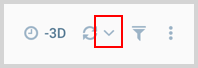

New - You now have the ability to configure how often a [dashboard is refreshed](https://help.sumologic.com/Visualizations-and-Alerts/Dashboard_(New)/About_Dashboard_(New)#Auto_Refresh) by clicking the dropdown arrow next to the refresh icon.

