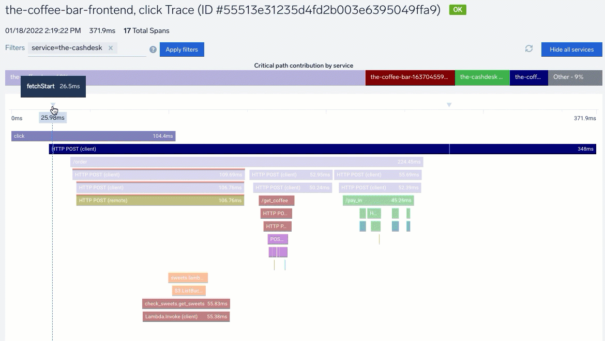

New - Traces now include [Span Events](https://help.sumologic.com/Traces/02Working_with_Tracing_data/03View_and_investigate_traces#Span_Events) that describe and contextualize the work being done in a Span by tracing and displaying that data in Trace Views. These events are optional time-stamped strings made up of a timestamp, name, and (optional) key-value pair attributes. Select a marker in the timeline or a span to review the Span Event data.

