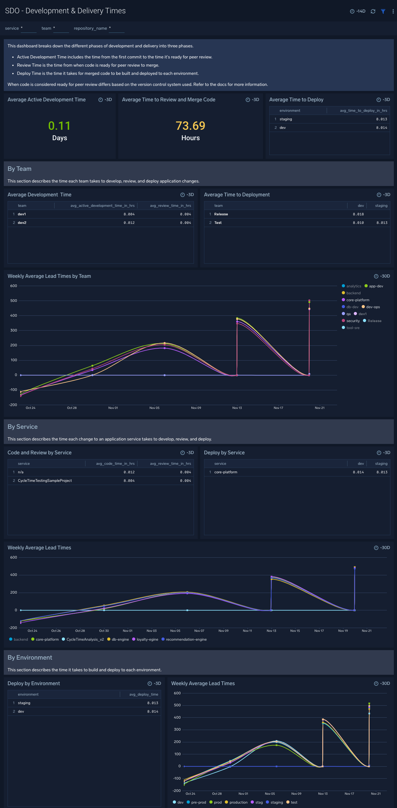

New - The SDO App now provides a [Software Development Optimization - Development & Delivery Times](https://help.sumologic.com/Other_Solutions/Software_Development_Optimization_Solution/04_View_the_Software_Development_Observability_Solution_Dashboards/Install_the_Software_Development_Optimization_App_and_view_the_Dashboards#SDO_-_Development_.26_Delivery_Times) dashboard to help you monitor development lead times and delivery lead times across the three main phases of development and delivery: Active Development, Review and Merge, and Deployment. Each section shows the phases broken down by team, service, and environment.

